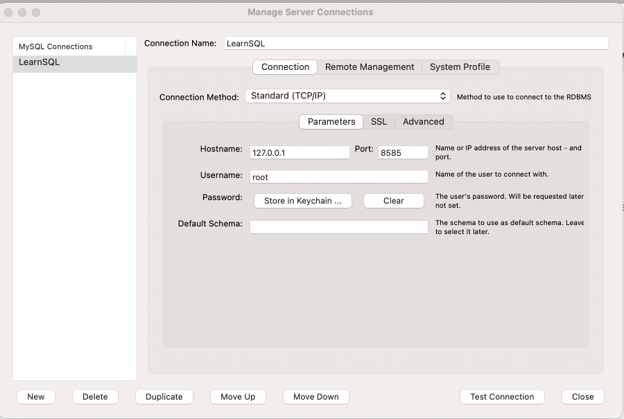

# movie-application
# Thiết Kế Cơ Sở Dữ Liệu cho Trang Web Xem Phim

## Hướng dẫn cài đặt MySQL

### Cách 1: Download và cài đặt MySQL qua hướng dẫn tại https://dev.mysql.com/doc/refman/8.2/en/installing.html
### Cách 2: Cài đặt MySQL trên docker
	+ Cài đặt docker qua hướng dẫn: https://docs.docker.com/desktop/
	+ Cài đặt MySQL bằng docker commdline: `docker run --name mysql -e MYSQL_ROOT_PASSWORD=123 -p 8585:3306 -d mysql:latest`
	+ Sau khi cài đặt, user là root và password là 123

## Hướng dẫn cài đặt MySQL Workbench
	+ Download MySQL Workbench qua hướng dẫn: https://dev.mysql.com/doc/workbench/en/wb-installing.html
	+ Tạo MySQL Connection với user/pass đã tạo khi cài đặt MySQL (root/123)

## Chạy SQL script để tạo database, bảng và nhập dữ liệu vào các bảng
Chạy tuần tự các scrip sau: 
[movie-tables.sql](movie-tables.sql)
[queries.sql](queries.sql)

## Sơ đồ cơ sở dữ liệu
[ERD.pdf](ERD.pdf)

## Hình ảnh giao diện

### Trang Chủ

### Danh Sách Phim

### Chi Tiết Phim

### Danh Sách Bài Viết

### Chi Tiết Bài Viết
